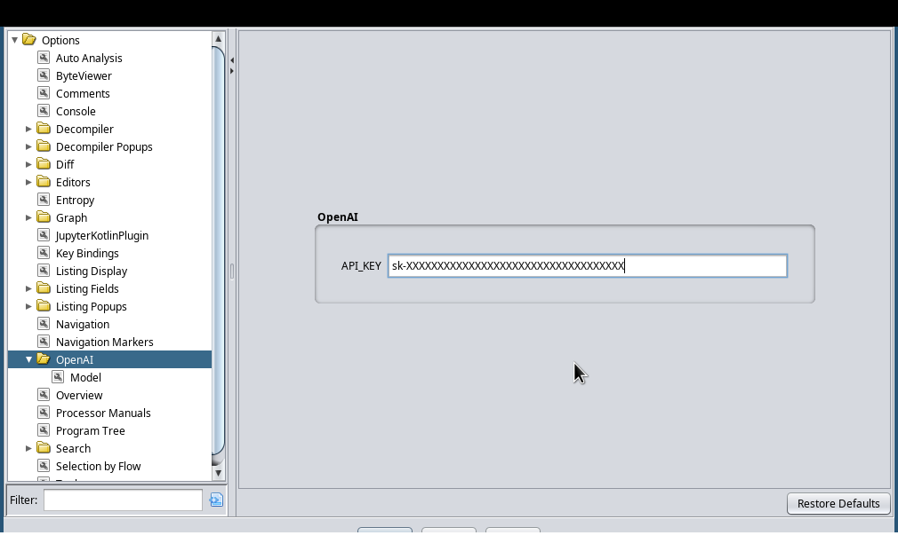
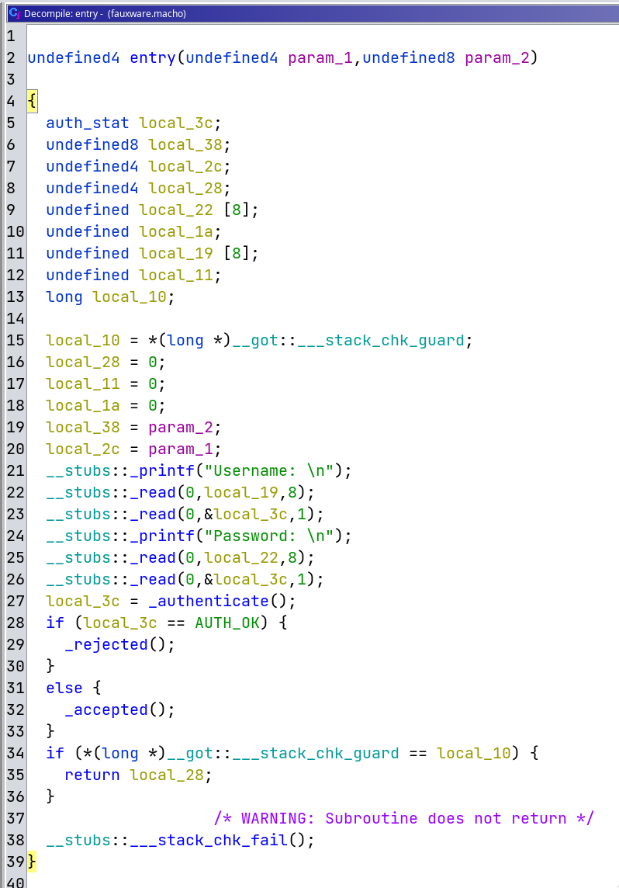
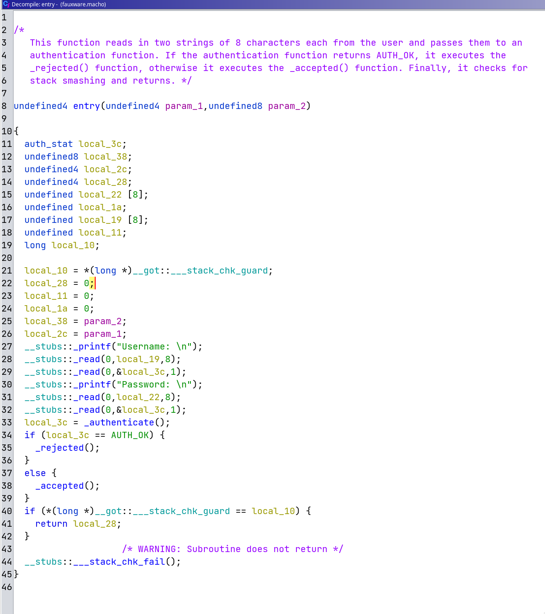
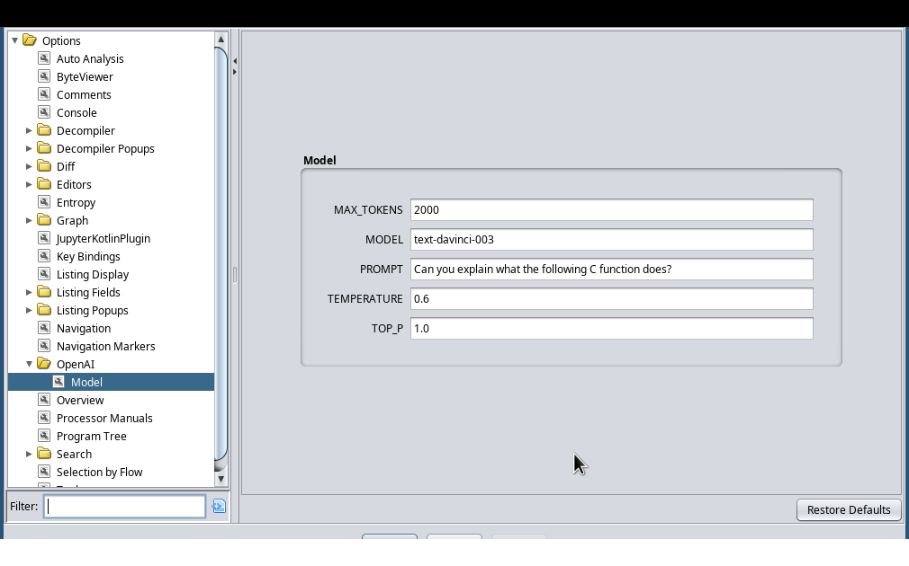

# OpenAI Integration for Ghidra

> Get Function Summaries from ChatGTP

## Installation

1. This plugin requires Kotlin language support in Ghidra, so make sure that you have it installed:
https://github.com/GhidraJupyter/ghidra-jupyter-kotlin/releases

2. Grab the latest release of this Plugin from the [releases page](https://github.com/fmagin/ghidra-openai/releases)
and install it in Ghidra.

## Usage

### Initial Setup

Configure your API Key via `Edit -> Tool Options -> OpenAI`

### GUI Integration

Right Click in the Decompiler, and select `Get and apply Function Summary via OpenAI`

Before:

After:

### Configuration

You can easily change the model used for the completions and its parameters via
the `Edit -> Tool Options -> OpenAI -> Model` menu.

The decompiled text will be appended to the prompt and will be sent as a completion request to the OpenAI API.

## Potential Future Work

No promises that I will ever implement them, but I'll gladly provide advice if you want to try:
* Dedicated Dialog that previews the function summary and allows retrying before applying
* Allow a custom prompt to be specified for a specific _program_ via the `Options for $program` menu
* Request better variable or function names like https://github.com/JusticeRage/Gepetto does